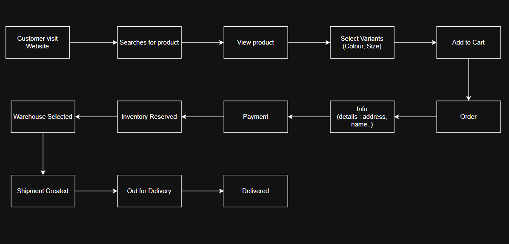
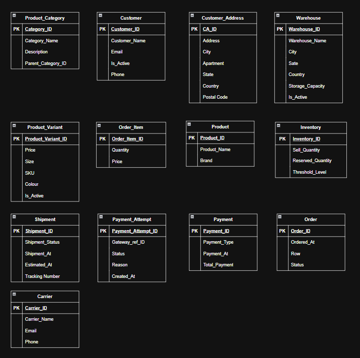
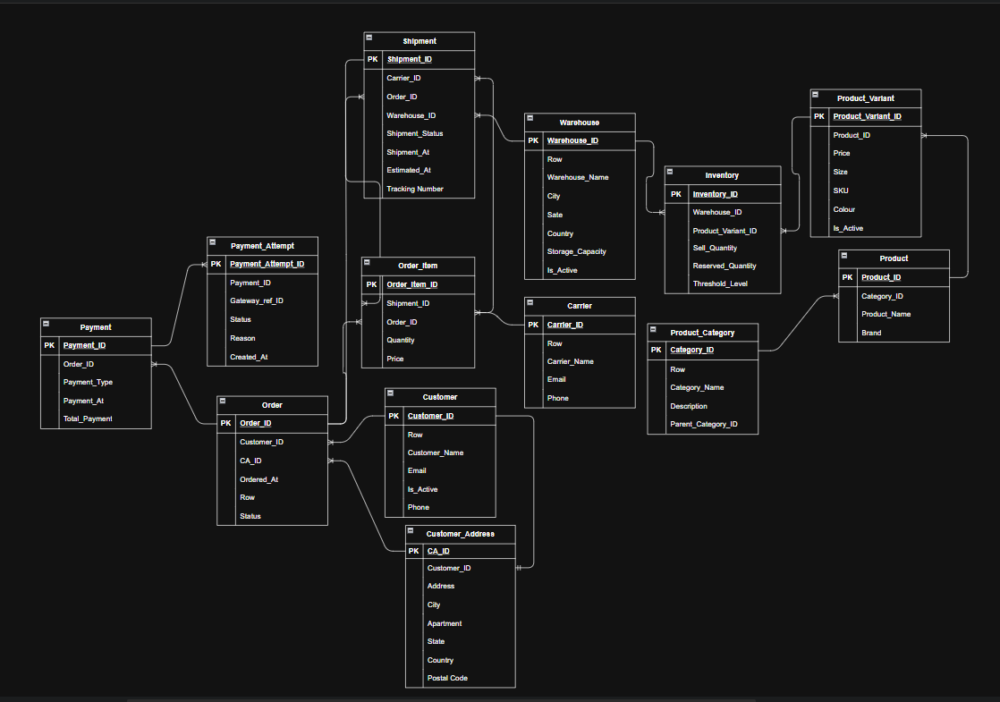

# E-Commerce Platform Database Architecture & Data Model

## Problem Overview
Relational database schema for a multi-warehouse e-commerce platform managing hierarchical product catalogs, SKU variants, multi-location inventory, customer orders, payment gateway transactions, and shipment logistics.

## 1. Business Process Flow

## 2. Logical Data Model

## 3. Physical Data Model (ERD)

## Schema Architecture

The database model consists of 13 core tables:

| Table Name | Description | Key Attributes |
| :--- | :--- | :--- |
| **`customer`** | Master customer profile records | `customer_id`, `customer_name`, `email`, `phone`, `is_active` |
| **`customer_address`** | Delivery addresses linked to customers | `ca_id`, `customer_id`, `address`, `customer_city`, `customer_state`, `country`, `postal_code` |
| **`product_category`** | Hierarchical category tree with parent-child links | `category_id`, `category_name`, `product_description`, `parent_category_id` |
| **`product`** | Master catalog for products | `product_id`, `category_id`, `product_name`, `brand`, `product_description` |
| **`product_variant`** | SKU-level variants (color, size, price) | `product_variant_id`, `product_id`, `sku`, `colour`, `product_size`, `price`, `is_active` |
| **`warehouse`** | Storage centers and fulfillment hubs | `warehouse_id`, `warehouse_name`, `city`, `state_name`, `country`, `storage_capacity`, `is_active` |
| **`inventory`** | Real-time stock levels per variant per warehouse | `inventory_id`, `warehouse_id`, `product_variant_id`, `available_quantity`, `reserved_quantity`, `threshold_level` |
| **`orders`** | Order headers linked to customers and addresses | `order_id`, `customer_id`, `ca_id`, `ordered_at`, `status` |
| **`order_item`** | Line items associated with orders and shipments | `order_item_id`, `order_id`, `product_variant_id`, `shipment_id`, `quantity`, `price` |
| **`payment`** | Master payment transaction records | `payment_id`, `order_id`, `payment_type`, `payment_at`, `total_payment` |
| **`payment_attempt`** | Gateway transaction attempts and response logs | `payment_attempt_id`, `payment_id`, `gateway_ref_id`, `status`, `reason`, `created_at` |
| **`carrier`** | Shipping providers and carrier details | `carrier_id`, `carrier_name`, `email`, `phone` |
| **`shipment`** | Dispatched packages and delivery tracking | `shipment_id`, `carrier_id`, `warehouse_id`, `order_id`, `shipment_status`, `shipment_at`, `estimated_at`, `tracking_number` |

## Key Business Queries
All SQL solutions are in [`Business_Solution.sql`](Business_Solution.sql):

1. **Total Inventory Visibility:** Aggregates available stock quantities across all warehouses per product.
2. **Customer Order Fulfillment Tracking:** Joins customer, orders, and shipment records to track delivery status.
3. **Stock Alerting (Low/Out of Stock):** Identifies items with zero stock or below threshold levels per warehouse.
4. **Category Revenue Analytics:** Calculates revenue generated by product category.
5. **Local Warehouse Fulfillment Check:** Evaluates whether local city warehouses can fulfill customer orders.
