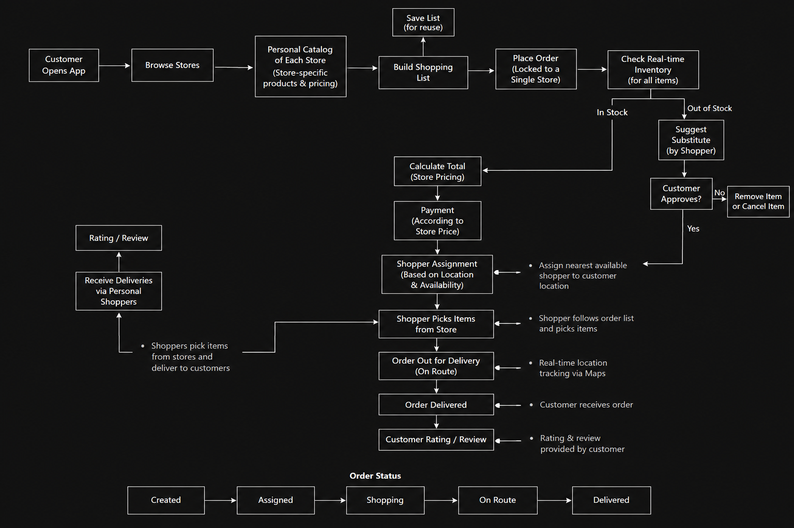
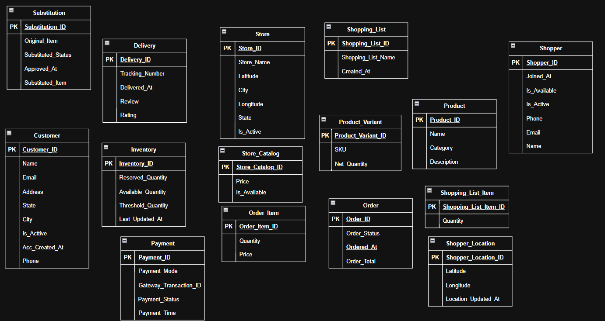
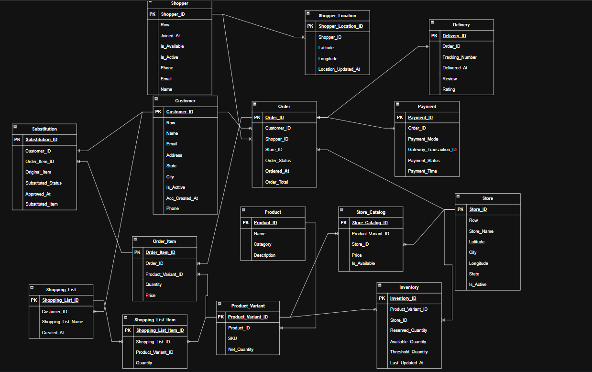

# Grocery Delivery Platform Database Architecture & Data Model

## Problem Overview
Relational database schema for an on-demand grocery delivery platform managing store-specific catalogs, real-time inventory, saved shopping lists, single-store orders, personal shopper proximity assignment, item substitutions, and delivery ratings.

## 1. Business Process Flow

## 2. Logical Data Model

## 3. Physical Data Model (ERD)

## Schema Architecture

The database model consists of 15 core tables:

| Table Name | Description | Key Attributes |
| :--- | :--- | :--- |
| **`customer`** | Master customer account records | `customer_id`, `name`, `email`, `phone`, `address`, `state`, `city`, `is_active`, `acc_created_at` |
| **`product`** | Master product catalog definitions | `product_id`, `name`, `category`, `description` |
| **`product_variant`** | SKU-level product variants and packaging | `product_variant_id`, `product_id`, `sku`, `net_quantity` |
| **`store`** | Grocery store locations and GPS coordinates | `store_id`, `store_name`, `latitude`, `longitude`, `city`, `state`, `is_active` |
| **`store_catalog`** | Store-specific product availability and pricing | `store_catalog_id`, `product_variant_id`, `store_id`, `price`, `is_available` |
| **`inventory`** | Store-level real-time inventory tracking | `inventory_id`, `product_variant_id`, `store_id`, `available_quantity`, `reserved_quantity`, `threshold_quantity`, `last_updated_at` |
| **`shopping_list`** | Customer saved shopping list headers | `shopping_list_id`, `customer_id`, `shopping_list_name`, `created_at` |
| **`shopping_list_item`** | Items and quantities in saved shopping lists | `shopping_list_item_id`, `shopping_list_id`, `product_variant_id`, `quantity` |
| **`orders`** | Order headers locked to a single store | `order_id`, `customer_id`, `shopper_id`, `store_id`, `order_status`, `ordered_at`, `order_total` |
| **`order_item`** | Line-item quantities and prices for an order | `order_item_id`, `order_id`, `product_variant_id`, `quantity`, `price` |
| **`shopper`** | Personal shopper profile details and availability | `shopper_id`, `name`, `email`, `phone`, `is_available`, `is_active`, `joined_at` |
| **`shopper_location`** | Live GPS coordinates for active shoppers | `shopper_location_id`, `shopper_id`, `latitude`, `longitude`, `location_updated_at` |
| **`substitution`** | Out-of-stock item substitution requests and approval | `substitution_id`, `customer_id`, `order_item_id`, `original_product_variant_id`, `substituted_product_variant_id`, `substituted_status`, `approved_at` |
| **`payment`** | Payment transaction details and gateway records | `payment_id`, `order_id`, `payment_mode`, `gateway_transaction_id`, `payment_status`, `payment_time` |
| **`delivery`** | Delivery tracking, ratings, and customer reviews | `delivery_id`, `order_id`, `tracking_number`, `delivered_at`, `review`, `rating` |

## Key Business Queries
All SQL solutions are in [`Business_Solution.sql`](Business_Solution.sql):

1. **Real-Time Store Inventory:** Checks available stock and threshold alerts for products at a designated store.
2. **Store-Specific Catalog & Pricing:** Compares product pricing and availability across store locations.
3. **Saved Shopping List Pricing:** Calculates current order totals for saved lists at a selected store.
4. **Shopper Proximity Assignment:** Identifies the nearest available shoppers to a store using GPS distance.
5. **Substitution Tracking:** Lists active item substitution requests awaiting customer approval.
6. **Order & Delivery Lifecycle:** Tracks order progress, assigned shoppers, payment, and delivery completion.
7. **Shopper Efficiency Analytics:** Measures completed orders and average items picked per shopper.
