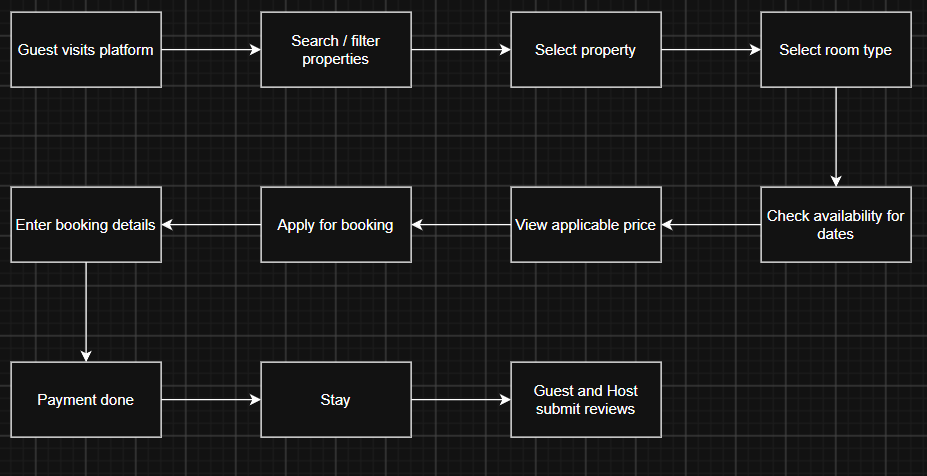
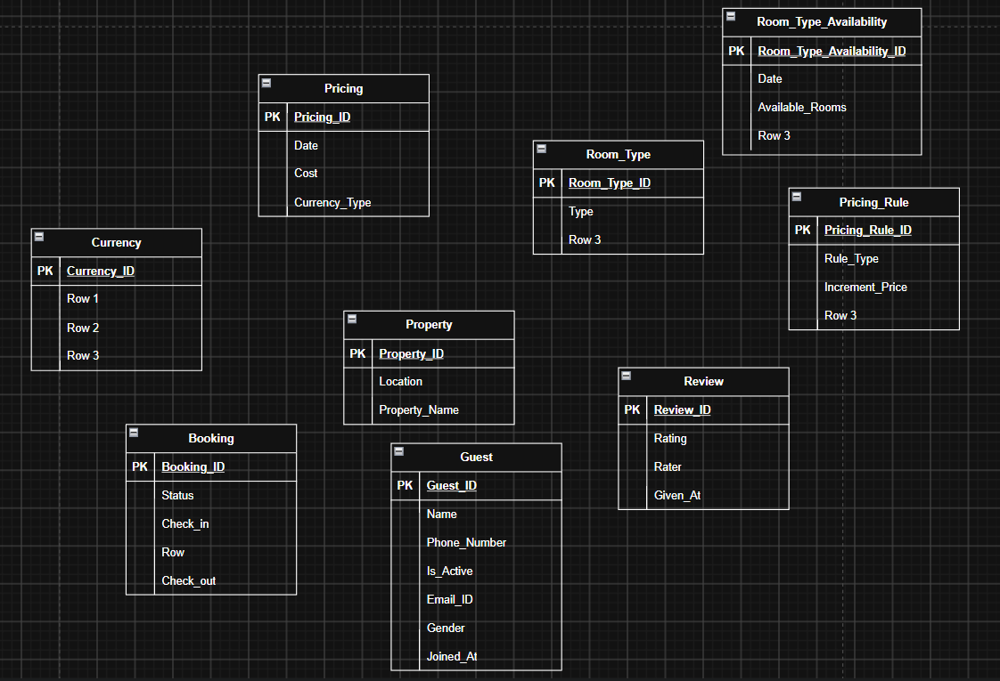
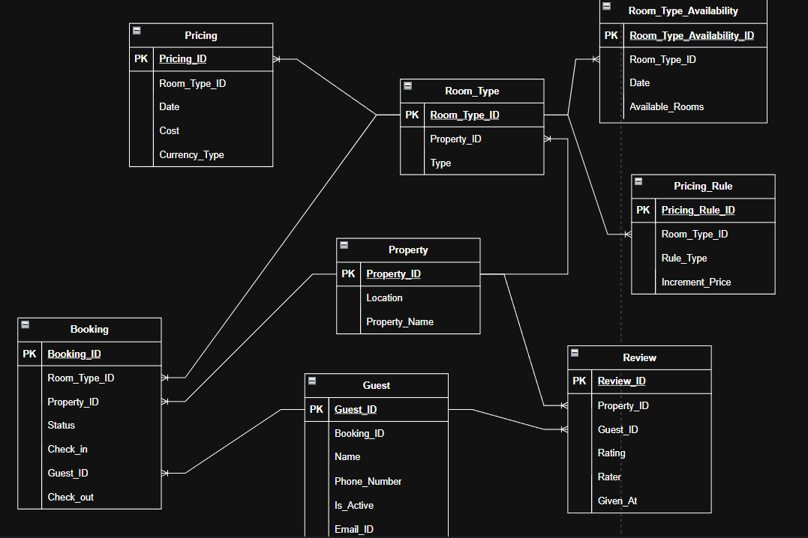

# Hotel & Hospitality Reservation Platform Database Architecture & Data Model

## Problem Overview
Relational database schema for a hotel and vacation rental reservation platform managing properties, room types, daily room availability, multi-currency pricing, dynamic pricing rules, booking lifecycles, and bidirectional reviews.

## 1. Business Process Flow

## 2. Logical Data Model

## 3. Physical Data Model (ERD)

## Schema Architecture

The database model consists of 7 core tables:

| Table Name | Description | Key Attributes |
| :--- | :--- | :--- |
| **`guest`** | Registered guest profiles | `guest_id`, `name`, `email_id`, `phone_number`, `gender`, `is_active`, `joined_at` |
| **`property`** | Property listings and location details | `property_id`, `property_name`, `location` |
| **`room_type`** | Room categories per property | `room_type_id`, `property_id`, `type` |
| **`room_type_availability`** | Daily room inventory counts per room type | `room_type_availability_id`, `room_type_id`, `date`, `available_rooms` |
| **`pricing`** | Daily base rates per room type and currency | `pricing_id`, `room_type_id`, `date`, `cost`, `currency_type` |
| **`pricing_rule`** | Dynamic pricing increment rules | `pricing_rule_id`, `room_type_id`, `rule_type`, `increment_price` |
| **`booking`** | Reservation records and stay intervals | `booking_id`, `room_type_id`, `property_id`, `guest_id`, `status`, `check_in`, `check_out`, `booking_amount` |
| **`review`** | Post-stay guest and host feedback | `review_id`, `property_id`, `guest_id`, `booking_id`, `rating`, `rater`, `given_at` |

## Key Business Queries
All SQL solutions are in [`Business_Solution.sql`](Business_Solution.sql):

1. **Property Availability Check:** Verifies room availability for specific check-in and check-out dates.
2. **Monthly Revenue per Property:** Computes monthly revenue per property for confirmed bookings.
3. **Pending Bookings Count:** Counts reservations awaiting confirmation.
4. **Guest Satisfaction Rating:** Calculates the average rating given by guests.
5. **Dynamic Pricing Demand Analysis:** Measures occupancy percentage to determine demand tiers (`LOW`, `MEDIUM`, `HIGH`).
