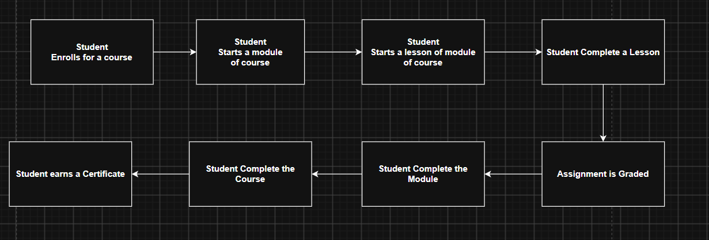
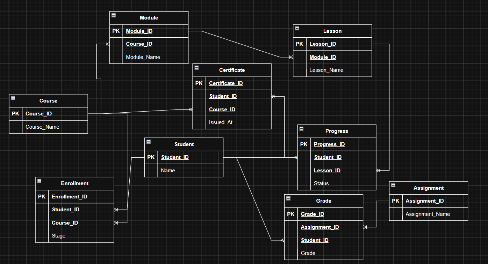

# Online Learning Platform Database Architecture & Data Model

## Problem Overview
Relational database schema for an online learning platform (such as Coursera or Udemy) managing courses, modular lesson hierarchies, student enrollments, granular lesson progress tracking, assignment submissions, grading, and completion certificates.

## 1. Business Process Flow

## 2. Physical Data Model (ERD)

> [!NOTE]
> The physical SQL schema was updated after creating the initial ERD to include descriptive naming columns (`module_name`, `lesson_name`), granular progress timestamps (`started_at`, `completed_at`, `last_watched_at`), and unique certificate verification codes (`certificate_code`) to support reporting and credential validation.

## Schema Architecture

The database model consists of 9 core tables:

| Table Name | Description | Key Attributes |
| :--- | :--- | :--- |
| **`student`** | Master registered student profile records | `student_id`, `name` |
| **`course`** | Master course catalog records | `course_id`, `course_name` |
| **`module`** | Course module divisions | `module_id`, `course_id`, `module_name` |
| **`lesson`** | Individual learning units within modules | `lesson_id`, `module_id`, `lesson_name` |
| **`enrollment`** | Student course registration and lifecycle status | `enrollment_id`, `student_id`, `course_id`, `stage`, `enrolled_at`, `completed_at` |
| **`progress`** | Lesson-level progress and granular engagement tracking | `progress_id`, `student_id`, `lesson_id`, `status`, `started_at`, `completed_at`, `last_watched_at` |
| **`assignment`** | Course assessment and assignment definitions | `assignment_id`, `course_id`, `assignment_name` |
| **`grade`** | Student evaluation marks and score records | `grade_id`, `assignment_id`, `student_id`, `grade` |
| **`certificate`** | Official course completion credentials & verification | `certificate_id`, `certificate_code`, `student_id`, `course_id`, `issued_at` |

## Key Business Queries
All SQL solutions are in [`Business_Solution.sql`](Business_Solution.sql):

1. **Course Completions:** Calculates total students who have successfully completed each course.
2. **Completion Rate & Time-to-Completion:** Computes course completion percentage and average duration from enrollment to completion.
3. **Lesson Dropout Analysis:** Identifies lessons with the highest dropout rates to highlight drop-off bottlenecks.
4. **Grade Distribution:** Analyzes student performance distributions across letter grade tiers (`A`, `B`, `C`, `D`, `F`) per course.
5. **At-Risk Student Identification:** Identifies and classifies students into risk levels (`LOW`, `MEDIUM`, `HIGH`) based on lesson dropouts.
