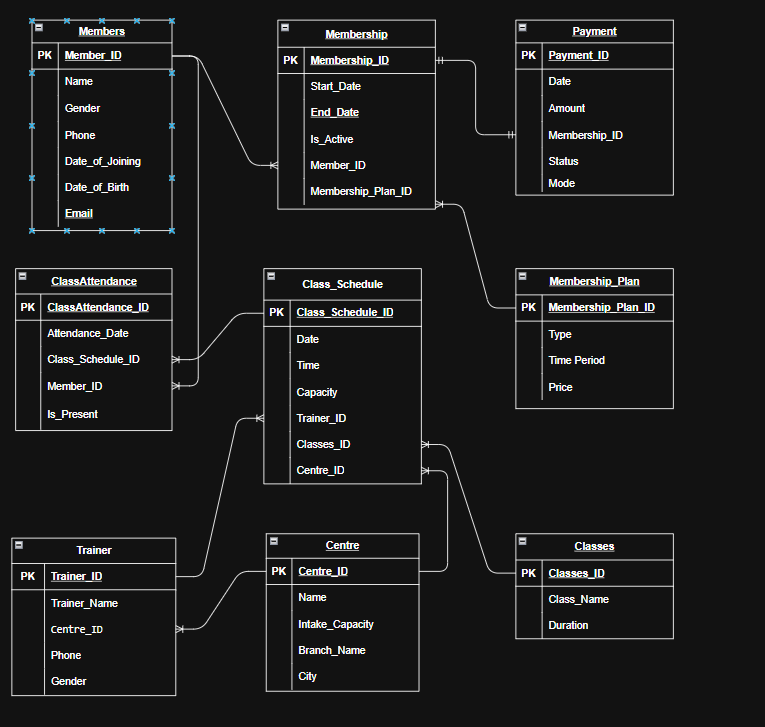

# Fitness Gym Chain Database & Physical Data Model

## Problem Statement
Design a relational database schema for a fitness gym chain operating multiple locations. The schema manages members, membership tiers, active subscriptions, payments, multi-location centres, trainers, class schedules, and member class attendance.

---

## Business Context
Gym chains need to track membership tiers, recurring payments, and class participation to monitor member engagement and predict churn. 

### Key Business Questions Answered:
1. **Approaching Expirations**: Which members have memberships expiring within the next 30 days?
2. **Active Members per Location**: How many active members does each gym location serve?
3. **Class Popularity**: Which fitness classes have the highest attendance?
4. **Monthly Churn Rate**: What percentage of memberships expire without renewal each month?
5. **Inactive Members (30+ Days)**: Which members haven't attended any classes in the last 30+ days?

---

## Requirements & Constraints
* **Multi-Plan Management**: Support membership plans with distinct durations and pricing models.
* **Subscription Tracking**: Active/inactive status tracking with renewal logic and check constraints.
* **Multi-Location Support**: Track 20+ gym centres with location-specific trainers and classes.
* **Attendance Logging**: Log class attendance records to analyze member engagement.
* **Churn & Expiration Detection**: High-performance indexed queries for daily automated alerts.
* **Scale**: Built to handle 50,000+ active members, 100+ weekly classes across 20 locations, and 1+ years of historical attendance logs.

---

## Entity Relationship Diagram (Data Model)

---

## Schema Architecture

The physical database model consists of 9 core tables:

| Table Name | Description | Key Attributes |
| :--- | :--- | :--- |
| **`members`** | Master table storing member personal details | `member_id`, `name`, `email`, `phone`, `date_of_joining` |
| **`membership_plan`** | Plan options (e.g., Monthly, Quarterly, Annual) | `membership_plan_id`, `type`, `time_period`, `price` |
| **`membership`** | Member subscription instances | `membership_id`, `member_id`, `membership_plan_id`, `start_date`, `end_date`, `is_active` |
| **`payment`** | Financial transactions for memberships | `payment_id`, `membership_id`, `payment_date`, `amount`, `status`, `mode` |
| **`centre`** | Gym location facilities | `centre_id`, `name`, `branch_name`, `city`, `intake_capacity` |
| **`trainer`** | Fitness trainers assigned to centres | `trainer_id`, `trainer_name`, `centre_id`, `phone` |
| **`classes`** | Master list of class types | `classes_id`, `class_name`, `duration` |
| **`class_schedule`** | Scheduled sessions across locations | `class_schedule_id`, `schedule_date`, `schedule_time`, `capacity`, `trainer_id`, `classes_id`, `centre_id` |
| **`class_attendance`** | Attendance logs per scheduled class | `classattendance_id`, `attendance_date`, `class_schedule_id`, `member_id`, `is_present` |

---

## Key Business Queries
All analytical queries answering key business questions are in -> [`scripts.sql`](scripts.sql). 

### Key Queries Included in `scripts.sql`:
1. **Approaching Expirations**: Identifies active memberships expiring within the next 30 days.
2. **Active Members per Location**: Counts distinct active members across each gym centre.
3. **Class Popularity**: Ranks fitness classes by total confirmed attendance (`is_present = TRUE`).
4. **Monthly Churn Rate**: Calculates the percentage of non-renewed memberships per month.
5. **Inactive Members (30+ Days)**: Flags active members who haven't logged attendance in over 30 days.

---

## Indexes & Performance Optimization
To support daily analytical queries across 50,000+ members and millions of attendance records, the following index strategy is implemented in `Physical_Data_Model.sql`:

- `idx_membership_member` & `idx_membership_enddate`: Optimized for subscription status and expiration queries.
- `idx_attendance_member` & `idx_attendance_date`: Fast lookup for churn detection and activity logs.
- `idx_schedule_centre` & `idx_schedule_class`: Accelerates location and class-level reporting.
